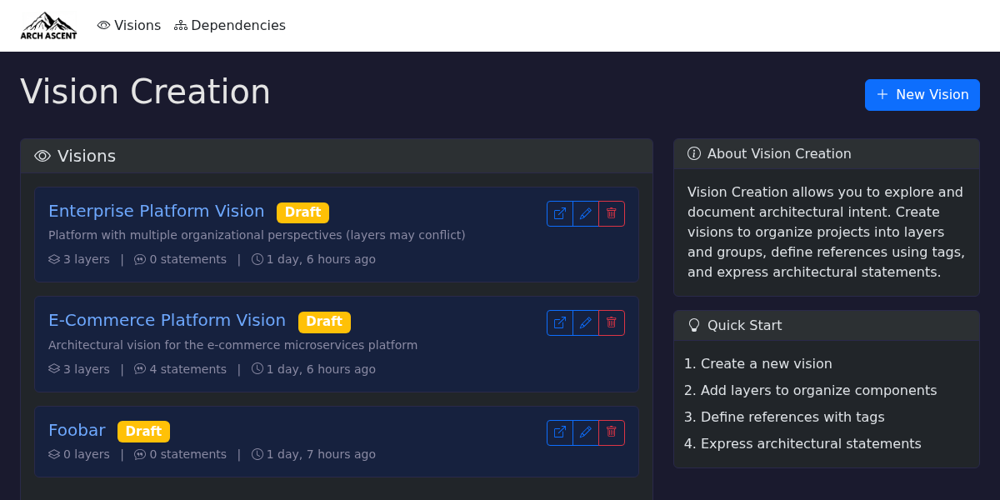

# Arch Ascent User Guide

Arch Ascent is an architectural governance tool for visualizing software dependencies and validating architectural constraints.

## Core Concepts

| Concept | Purpose |
|---------|---------|
| **Vision** | Workspace for exploring an architectural scenario. Contains layers, references, and statements. |
| **Layer** | Named grouping of components (e.g., "Domain Layer", "Team Ownership"). |
| **Reference** | Named set of components, defined by tags, layer membership, or explicit list. |
| **Statement** | Architectural constraint evaluated against the dependency graph. |

## Navigation

- **Home** (`/vision/`) — List of visions, create/duplicate/archive
- **Vision Canvas** (`/vision/{id}/`) — Interactive graph, layers panel, statements panel
- **Dependency Graph** (`/`) — Raw dependency visualization with metrics

## Guides

- [Visions](02-visions.md) — Canvas interaction, versions
- [Layers](03-layers.md) — Grouping components
- [References](04-references.md) — Defining component sets
- [Statements](05-statements.md) — Writing and evaluating constraints
