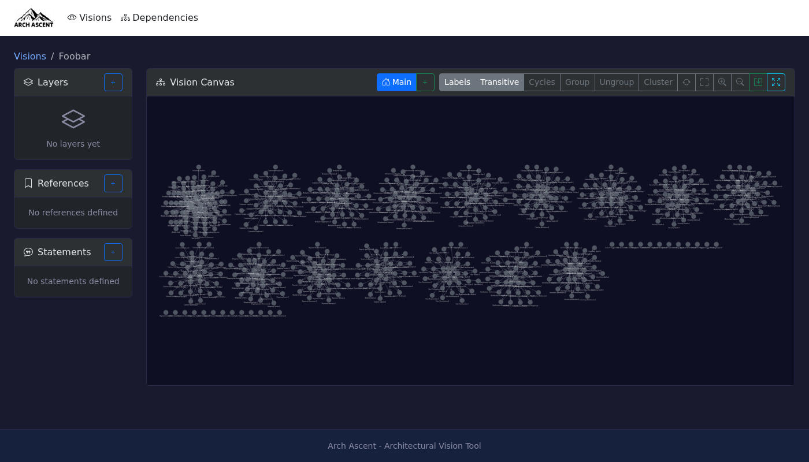

# Visions

A vision is a workspace for defining and validating an architectural scenario.

## Creating Visions

From the home page, click **New Vision**. Provide a name and optional description.

| Status | Meaning |
|--------|---------|
| Draft | Work in progress, editable |
| Shared | Published for review, read-only for others |
| Archived | Historical reference |

## Canvas Controls

| Action | Control |
|--------|---------|
| Pan | Click + drag on empty space |
| Zoom | Scroll wheel |
| Select component | Click node |
| Multi-select | Shift + click, or drag selection box |
| Move component | Drag selected node(s) |
| Context menu | Right-click node |

Layouts are auto-saved. Manual save available via toolbar.

## Versions

Versions are alternative layouts of the same vision. Statements and references are shared across all versions.

| Action | How |
|--------|-----|
| Create version | Click **+** next to version tabs |
| Switch version | Click version tab |
| Snapshot current layout | Edit version, enable "Snapshot current layout" |
| Delete version | Edit version, click Delete |

Use versions to compare different arrangement strategies (e.g., "by domain" vs "by team").
