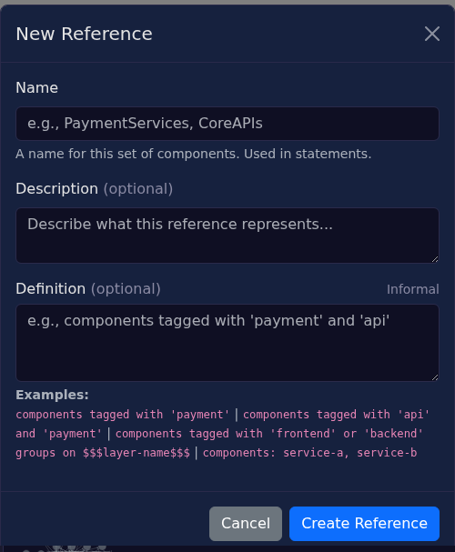

# References

References are named sets of components used in statements. A reference resolves to zero or more components based on its definition.



## Definition Syntax

| Type | Syntax | Example |
|------|--------|---------|
| Tag expression | `components tagged with '<tag>'` | `components tagged with 'payment'` |
| Layer membership | `groups on $$$<layer-key>$$$` | `groups on $$$team-ownership$$$` |
| Explicit list | `components: <key1>, <key2>` | `components: order-api, payment-api` |

## Tag Expressions

Boolean operators with standard precedence (NOT > AND > OR). Use parentheses to override.

| Expression | Matches |
|------------|---------|
| `'payment'` | Components tagged "payment" |
| `'api' and 'payment'` | Components with both tags |
| `'api' or 'payment'` | Components with either tag |
| `not 'deprecated'` | Components without tag |
| `('api' or 'service') and not 'deprecated'` | Combined expression |

Full syntax:
```
components tagged with <expression>

<expression> :=
  | '<tag>'
  | <expression> and <expression>
  | <expression> or <expression>
  | not <expression>
  | ( <expression> )
```

## Validation

The definition field validates as you type:

| Indicator | Meaning |
|-----------|---------|
| ✓ Tag Expression | Valid, parsed as tag expression |
| ✓ Layer | Valid, references a layer |
| ✓ Explicit List | Valid, explicit component list |
| ✗ Invalid | Syntax error |
| Informal | Empty definition (reference exists but not formally defined) |

## Using References in Statements

Reference a defined set using `$$$reference-name$$$` tokens in statement text. The statement editor provides autocomplete for available references.
