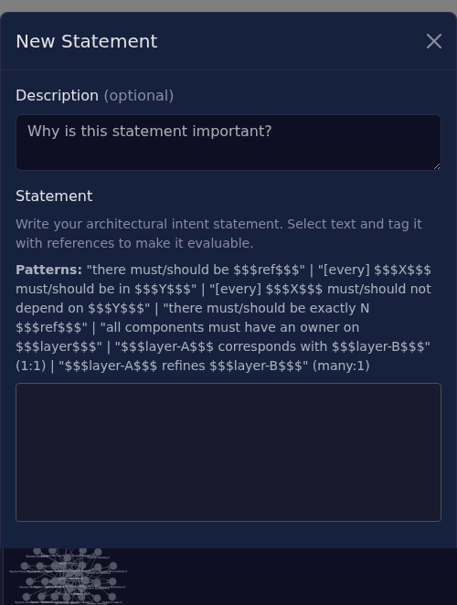

# Statements

Statements are architectural constraints written in natural language and evaluated against the dependency graph.



## Statement Types

| Type | Pattern | Example |
|------|---------|---------|
| Existence | `there must be $$$ref$$$` | `there must be $$$payment-gateway$$$` |
| Containment | `$$$X$$$ must be in $$$Y$$$` | `$$$payment-services$$$ must be in $$$domain-layer$$$` |
| Exclusion | `$$$X$$$ must not depend on $$$Y$$$` | `$$$frontend$$$ must not depend on $$$database$$$` |
| Cardinality | `there must be exactly N $$$ref$$$` | `there must be exactly 1 $$$api-gateway$$$` |
| Coverage | `all components must have an owner on $$$layer$$$` | `all components must have an owner on $$$team-ownership$$$` |
| Correspondence | `$$$A$$$ corresponds with $$$B$$$` | `$$$bounded-contexts$$$ corresponds with $$$team-ownership$$$` |
| Refinement | `$$$A$$$ refines $$$B$$$` | `$$$gitlab-groups$$$ refines $$$team-ownership$$$` |

## Modifiers

- `must` — Hard constraint (violation is error)
- `should` — Soft constraint (violation is warning)
- `every` — Optional emphasis: `every $$$api$$$ must be in $$$public-layer$$$`

## Evaluation Status

| Indicator | Meaning |
|-----------|---------|
| ✓ (green) | Constraint satisfied |
| ✗ (red) | Constraint violated |
| — | Not evaluated (informal or missing references) |

## Formalization Status

| Status | Meaning |
|--------|---------|
| Informal | Natural language only, not parseable |
| Semi-formal | Partially parsed, some references unresolved |
| Formal | Fully parsed, all references resolve, evaluable |

## Correspondence vs Refinement

Both relate two layers, but with different cardinality:

**Correspondence** (1:1) — Each group in layer A maps to exactly one group in layer B with the same members.

```
$$$team-ownership$$$ corresponds with $$$bounded-contexts$$$
```
Valid when: Team Alpha owns exactly the components in Context Alpha.

**Refinement** (many:1) — Layer A is a finer partitioning of layer B. Multiple groups in A map to one group in B.

```
$$$gitlab-groups$$$ refines $$$team-ownership$$$
```
Valid when: GitLab groups `payments-api`, `payments-core`, `payments-db` together cover all components owned by Team Payments.

## Writing Statements

1. Open Statements panel (right sidebar)
2. Click **New Statement**
3. Type natural language with `$$$reference$$$` tokens
4. Select text and tag with references using the popup
5. System infers type and formalization status

The editor autocompletes reference names when typing `$$$`.
